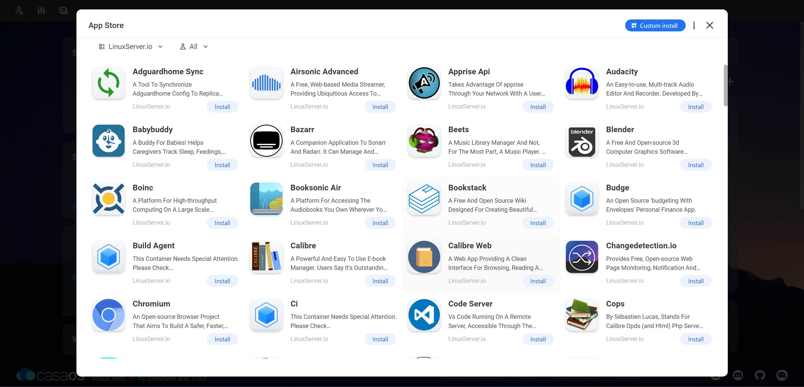

# CasaOS LocalAI AppStore

A CasaOS custom Appstore containing some usefull images.
The **LocalAI AppStore** is a custom appstore built to work for [CasaOS](https://github.com/IceWhaleTech/CasaOS).
This custom appstore for CasaOS contains some additional configurations of docker images which are not available in the official appstore and I think they are useful.

## 🛠 List of Applications

### **1. [Serge.chat](https://github.com/serge-chat/serge)** (version: 0.5.0)

Serge is a sophisticated web interface designed for chatting with Alpaca through llama.cpp. This software stands out for its full dockerization and user-friendly API. It offers a seamless experience for users looking to interact with Alpaca models, providing a SvelteKit frontend and Redis for storing chat history and parameters. Serge is built on FastAPI + LangChain for the API, wrapping calls to llama.cpp using Python bindings.

### **2. [Mimic 3](https://mycroft-ai.gitbook.io/docs/mycroft-technologies/mimic-tts/mimic-3)** (version: 3.0.0)

Mimic is a fast, lightweight Text-to-speech engine developed by Mycroft A.I. and VocaliD, based on Carnegie Mellon University’s FLITE software. Mimic takes in text and reads it out loud to create a high quality voice. Mimic is low-latency and has a small resource footprint. It is great for embedded devices and servers alike. Mimic is also multi-lingual, supporting English, German, Spanish, French, and Italian.

### **3. [Elasticsearch](https://www.elastic.co/elasticsearch/)** (version: 7.15.0)

Elasticsearch is a distributed, RESTful search and analytics engine capable of solving a growing number of use cases. As the heart of the Elastic Stack, it centrally stores your data so you can discover the expected and uncover the unexpected.

### **4. [ElasticHQ](https://github.com/ElasticHQ/elasticsearch-HQ)** (version: 3.5.12)

ElasticHQ is a simple, lightweight, free application that allows you to monitor and manage your ElasticSearch clusters with ease. Works with 2.x, 5.x, 6.x, 7.x and current versions of Elasticsearch. Monitor many clusters at once. Monitor Nodes, Indices, Shards, and general cluster metrics. Create and maintain Elasticsearch Indices. One-Click access to ES API and cat API endpoints. Easy-to-Use Querying capabilities. Copy mappings and reindex Indices. Real-time monitoring charts of important metrics. Diagnostics check-up helps alert to specific nodes having issues. Active project used by Fortune 100 companies around the world.

### **5. [Kopia](https://kopia.io/)** (version: latest)

Kopia is a simple, cross-platform tool for managing encrypted backups in the cloud. It provides fast, incremental backups, secure, client-side end-to-end encryption, data deduplication, and compression. Kopia is written in Go and released under the Apache 2.0 license.

### **6. [OpenTTS](https://github.com/synesthesiam/opentts)** (version: 2.1)

OpenTTS is a collection of open source speech synthesis systems, including:
Larynx, Glow-Speak, Coqui-TTS, nanoTTS, MaryTTS, flite, Festival and eSpeak voices. It is very large and takes a longer time to install based on your internet speed.

### **7. [OpenSpeedTest](https://hub.docker.com/r/openspeedtest/latest)** (version: latest)

SpeedTest by OpenSpeedTest™ is a Free and Open-Source HTML5 Network Performance Estimation Tool Written in Vanilla Javascript and only uses built-in Web APIs like XMLHttpRequest (XHR), HTML, CSS, JS, & SVG. No Third-Party frameworks or libraries are Required. All we need is a static web server like NGINX. I started this project in 2011 and moved to OpenSpeedTest.com dedicated Project/Domain Name in 2013.

### **8. [Plex](https://www.plex.tv/)** (version: latest)

Plex is a client-server media player system plus an ancillary software suite. The Plex Media Server desktop application runs on Windows, macOS, and Linux. The server desktop application organizes video, audio, and photos from a user's collections and from online services, enabling the players to access and stream the contents. There are official clients available for mobile devices, smart TVs, and streaming boxes, a web app, and Plex Home Theater (no longer maintained), as well as many third-party alternatives.

### **9. [RSS Bridge](https://github.com/RSS-Bridge/rss-bridge)** (version: latest)

RSS-Bridge is a PHP project capable of generating RSS and Atom feeds for websites that don't have one. It can be used on webservers or as a stand-alone application in CLI mode. RSS-Bridge is easy to install and use, and it is compatible with a lot of websites. It is a great tool for people who want to follow a lot of websites and don't want to miss any news.

### **10. [OLLAMA](https://ollama.com/)** (version: latest)

OLLAMA is a free, open-source, and easy-to-use AI-powered chatbot that can be used to create conversational AI applications. It is built on top of the OpenAI GPT-3 model and can be used to create chatbots for a wide range of applications, including customer service, marketing, and education. OLLAMA is designed to be easy to use and requires no coding or technical expertise to get started. It is available as a web-based application and can be accessed from any device with an internet connection.

### **11. [OpenWebUi](https://github.com/open-webui/open-webui)** (version: latest)

Open WebUI is an extensible, feature-rich, and user-friendly self-hosted WebUI designed to operate entirely offline. It supports various LLM runners, including Ollama and OpenAI-compatible APIs. Clear and simple interface, with lot of features and settings. It is a great tool for people who want to create and manage conversational AI applications and also custom chatbot models.

### **12. [MeiliSearch](https://www.meilisearch.com/)** (version: latest)

MeiliSearch is a powerful, fast, open-source, easy to use, and deploy search engine. Both searching and indexing are highly customizable. Features such as typo-tolerance, filters, and synonyms are provided out-of-the-box. For more advanced customization, the engine can be configured to fit your specific needs. MeiliSearch is designed to be easy to use and deploy, and it is available as a self-hosted solution or as a managed service.

## ✅ Installation

**Custom appstore method**

- Go to your CasaOS dashboard.

- Open the appstore and click `Add Source` button located on the right just above the apps list.

  

- Paste the appstore link

```bash
https://github.com/eudard/CasaOS-LocalAI-AppStore/archive/refs/tags/latest.zip
```

- Then click `Add` to submit and Wait for the installation to finish. Done!

> **NOTE: Custom Appstore is only supported on CasaOS version [0.4.4](https://blog.casaos.io/blog/32.html) and above. **

**Manual install**

Another method is simply download desired app docker-compose.yml file and upload it to your CasaOS dashboard by open `App Store` and click to `Custom Install` button located on the top right.

## Supporting/Sponsoring this project

You like the project and you want to support me?

[](https://www.paypal.com/donate/?hosted_button_id=7XXMAR2GYQ6BE)
